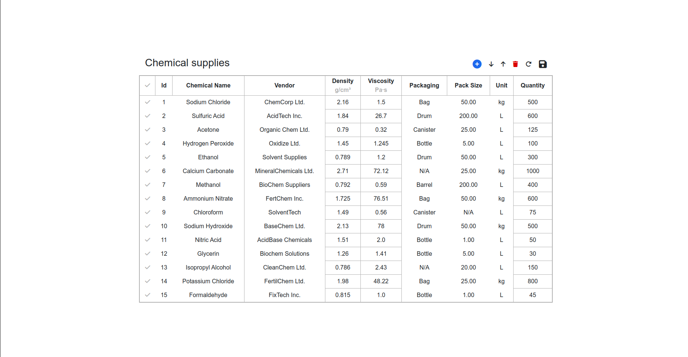
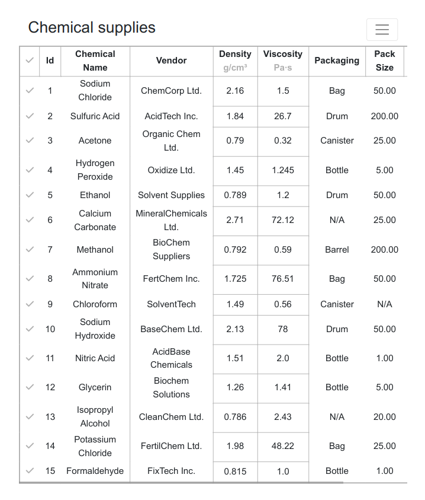
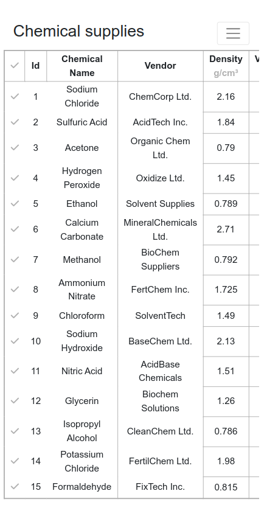

# JS-programmer-task

This repository contains all the functionality to interact with the table such as - adding new row, move rows up and down, delete row, refresh table, edit row and save data. 

## Features

The banking application provides the following features:

1. SORT COLUMN: Users can sort the table in ascending (first click) and descending order (second click) by clicking on the column header.

2. ADD ROW: Users can add new rows to the table by specifying the necessary information.

3. MOVE ROW UP & DOWN: Users can move selected row up and down in the table by clicking on the arrows button. Even user can move more than one row at a time.

4. DELETE ROW: Users can delete the selected row from the table by clicking on the delete button.

5. REFRESH TABLE: Users can refresh the table by clicking on the refresh button after clicking on it, It will delete all the unsaved changes and saved data will be perserved.

6. SAVE DATA: Users can save changes made in the table by clicking on the save button so that it will be saved and refresh button can't delete it.

7. EDIT ROW: Users can edit every data of the table by simply clicking on that.

8. BROWSER REFRESH: Users can refresh the whole table by clicking on the browser refresh button and it will delete all the saved and unsaved changes.

## Preview 

### Desktop view

  

### Tab view

  

### Mobile view

  

## Getting Started

To use all the features of this task, follow the instructions below:

1. Clone this repository to your local machine.

2. Open the clone directory on your preferred code editor.

3. Install any live server extension.

4. start server using `Go Live` button.

## Dependencies

This task has the following dependencies:

- HTML
- CSS
- JavaScript
- Bootstrap

## Contact

If you have any questions, feedback, or concerns regarding this project, please feel free to reach out:

- [Lakshman Kumar](mailto:lakshmankumar2603@gmail.com)

Thank you!
